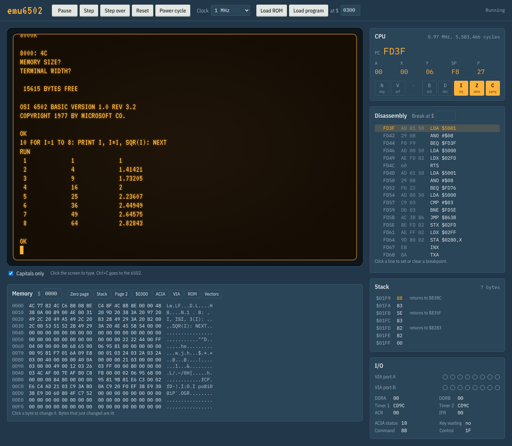
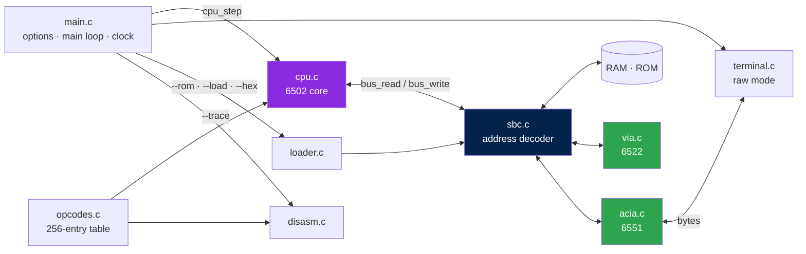

<div align="center">

# 🖥️ emu6502

**A 6502 single-board computer emulator, written in C**

emu6502 emulates a small 6502 computer: the CPU, 16 KiB of RAM, 32 KiB of ROM, a 6551 ACIA serial port and a 6522 VIA. It runs at 1 MHz in your terminal, and the included ROM boots WozMon and Microsoft BASIC.

<br/>


<br/>



</div>

---

## ⚡ At a glance

|  |  |
|---|---|
| 🧠 **CPU** | NMOS 6502 core: all 151 official opcodes, decimal mode, the NMOS quirks, per-instruction cycle counts |
| 🗺️ **Memory** | 16 KiB RAM · 32 KiB ROM · ACIA at `$5000` · VIA at `$6000` |
| 📡 **Serial** | 6551 ACIA wired to your terminal in raw mode |
| 🔌 **I/O** | 6522 VIA: both ports and both timers, with a live display of the port pins |
| ⏱️ **Timing** | Runs at 1 MHz in real time by default; any clock speed, or unlimited |
| 🔍 **Debugging** | Instruction trace with disassembly, registers, flags and cycle count |
| 📦 **Loaders** | ROM images, raw binaries at any address, WozMon text files (`0300: A9 01 ...`) |
| 💾 **ROM** | MS BASIC + BIOS + WozMon, built with cc65 |
| 🌐 **Web UI** | The same C core in WebAssembly: terminal, registers, disassembly, breakpoints, stack, memory and I/O in the browser |
| 🛠️ **Tooling** | C11 + POSIX, a plain Makefile, no libraries beyond libc |

> [!NOTE]
> The emulator is accurate to the instruction, not to the cycle. Each instruction takes the right number of cycles, but the dummy reads and double writes inside NMOS instructions are not reproduced. Nothing in the emulated system depends on them. See [Known limitations](#-known-limitations).

## 📑 Table of contents

- [Demo](#-demo)
- [Architecture](#️-architecture)
- [Repository layout](#-repository-layout)
- [Emulated system](#-emulated-system)
- [Getting started](#-getting-started)
- [Usage](#-usage)
- [Web interface](#-web-interface)
- [Testing](#-testing)
- [Known limitations](#-known-limitations)

## 🎬 Demo

Microsoft BASIC, started from WozMon:

```
$ ./emu6502 --rom rom.bin
[6502 SBC emulator - Ctrl+] quits, Ctrl+R resets]
\
8000R

8000: 4C
MEMORY SIZE?
TERMINAL WIDTH?

 15615 BYTES FREE

OSI 6502 BASIC VERSION 1.0 REV 3.2
COPYRIGHT 1977 BY MICROSOFT CO.

OK
10 PRINT MID$("/\",RND(1)*2+1,1);:GOTO 10
RUN
\/\\\///\/\\//\/\\\//\\\//\\//\/\//\\\/\\\\\/\\\/\/\/////\/\\\\\/\/\/\\\
///\//\\/\/\\\\//\//\\\////\/\\\\/\/\\/\//\/\///////\//\\\\\\//////\/\\\
```

A machine-language program typed into WozMon, printing through the BIOS `CHROUT` at `$FD03`:

```
\
0300: A2 00 BD 10 03 F0 06 20 03 FD E8 D0 F5 4C 00 FE
0310: 48 45 4C 4C 4F 21 0D 00
300R

0300: A2HELLO!
\
```

## 🏗️ Architecture

The CPU knows nothing about the rest of the system. It reads and writes through the three functions of `bus.h`. The same `cpu.c` is linked with `sbc.c` in the emulator, and with a flat 64 KiB test bus in the test programs.



The main loop runs the CPU in slices of 1 ms of emulated time. After each slice it moves bytes between the ACIA and the terminal, and sleeps until real time catches up. The VIA timers advance after every instruction.

## 📁 Repository layout

```
emu6502/
├── emu6502/
│   ├── Makefile
│   ├── src/
│   │   ├── main.c             Options, main loop, keyboard queue, real-time clock, trace
│   │   ├── cpu.c / cpu.h      The 6502 core
│   │   ├── opcodes.c / .h     Name, addressing mode and cycles of all 256 opcodes
│   │   ├── bus.h              The CPU's only view of the world
│   │   ├── sbc.c / sbc.h      Memory map and address decoder
│   │   ├── acia.c / acia.h    6551 ACIA
│   │   ├── via.c / via.h      6522 VIA
│   │   ├── terminal.c / .h    Raw-mode keyboard and screen (POSIX termios)
│   │   ├── loader.c / .h      ROM, binary and WozMon-text loaders
│   │   └── disasm.c / .h      One-instruction disassembler
│   └── tests/
│       ├── test_cpu.c         Unit tests for single instructions
│       ├── functest.c         Runner for Klaus Dormann's 6502 functional test
│       └── flatbus.c / .h     64 KiB flat-RAM bus for the tests
├── web/
│   ├── index.html             The web interface
│   ├── app.js / style.css     Terminal, panels, keyboard, file loading
│   ├── emu-wasm.js            The C core as WebAssembly (generated)
│   ├── fonts/                 VT323 and IBM Plex, self-hosted (OFL)
│   └── wasm/
│       ├── emu_wasm.c         Exports the core to JavaScript
│       └── build.sh           Builds emu-wasm.js with clang
├── rom/
│   ├── rom.s                  ROM top level: MS BASIC + BIOS + jump tables + vectors
│   ├── wozmon.s               WozMon
│   ├── sbc6502.cfg            ld65 memory layout
│   └── build.sh               Builds rom.bin
└── docs/
    ├── rom.md                 Memory map, I/O registers, ROM layout, BIOS
    └── images/                Screenshot
```

## 🔧 Emulated system

### Memory map

| Address | Chip | Notes |
|---|---|---|
| `$0000-$3FFF` | RAM, 16 KiB | Zero page, stack, then free RAM |
| `$4000-$4FFF` | — | Free, reads `$FF` |
| `$5000-$5FFF` | ACIA 6551 | 4 registers, mirrored |
| `$6000-$6FFF` | VIA 6522 | 16 registers, mirrored |
| `$7000-$7FFF` | — | Free, reads `$FF` |
| `$8000-$FFFF` | ROM, 32 KiB | Writes from the CPU are ignored |

Each I/O device answers anywhere in its 4 KiB slot: the ACIA's 4 registers and the VIA's 16 repeat across the whole window. The register list is in [`docs/rom.md`](docs/rom.md).

### CPU

- All 151 documented NMOS 6502 opcodes, in all 13 addressing modes.
- Decimal mode for ADC and SBC, with the NMOS flag behaviour (N, V and Z as the original chip computes them).
- The `JMP ($xxFF)` page-wrap bug, zero-page wrap-around, and the B flag only in pushed copies of P.
- Cycle counts include the +1 for page crossings on indexed reads and the +1/+2 for taken branches.
- Undocumented opcodes stop the CPU and report the address, instead of imitating the chip.

### 6551 ACIA

| Register | Emulated |
|---|---|
| Data | Read: last received byte, clears RDRF · Write: sent to the terminal at once |
| Status | Computed from the state: TDRE is always 1, RDRF is set when a byte is waiting |
| Command / Control | Stored, with the programmed reset on writes to Status |

Keys go into a 256-byte queue and are handed to the ACIA one at a time, whenever its receive register is empty. You can paste whole programs into WozMon without losing a character.

### 6522 VIA

- Ports A and B with their data direction registers. Inputs read `$FF`, like unconnected pins.
- Timer 1 in one-shot and free-run mode; timer 2 in one-shot mode. The IFR flags are cleared by reading the counter or by writing the IFR.
- `--ports` shows the pins whenever they change: `#` is an output at 1, `.` an output at 0, `-` an input.

### ROM

| Address | Contents |
|---|---|
| `$8000` | `JMP COLD_START`: type `8000R` in WozMon to start BASIC |
| `$8003-$9EE4` | Microsoft BASIC (OSI 1.0 rev 3.2) |
| `$9EE5-$FCFF` | Free, about 24 KiB |
| `$FD00` / `$FD03` | BIOS `CHRIN` / `CHROUT` |
| `$FE00` | WozMon |
| `$FFFA-$FFFF` | NMI, RESET, IRQ vectors |

## 🚀 Getting started

<details open>
<summary><b>1 · Build the emulator</b></summary>

<br/>

You need a C11 compiler (gcc or clang) and `make`. On Windows, use WSL.

```bash
git clone https://github.com/StringLess80/emu6502.git
cd emu6502/emu6502
make
```

Without `make`:

```bash
gcc -std=c11 -Wall -Wextra -Wpedantic -O2 -o emu6502 src/*.c
```

</details>

<details>
<summary><b>2 · Build the ROM</b></summary>

<br/>

The ROM is 6502 assembly. It is built with `ca65`/`ld65` from [cc65](https://cc65.github.io/) (`brew install cc65` or `apt install cc65`), using the Microsoft BASIC sources reconstructed in [mist64/msbasic](https://github.com/mist64/msbasic). From the repository root:

```bash
git clone https://github.com/mist64/msbasic
cd rom
MSBASIC=../msbasic ./build.sh                  # makes rom.bin, 32768 bytes
```

Offset 0 of `rom.bin` is `$8000`. The ROM layout and the BIOS entry points are described in [`docs/rom.md`](docs/rom.md).

</details>

<details>
<summary><b>3 · Run it</b></summary>

<br/>

```bash
../emu6502/emu6502 --rom rom.bin
```

WozMon prints `\`. Type `8000R` to start BASIC, and press Enter at the two questions.

</details>

## 💻 Usage

```
./emu6502 --rom FILE [options]
```

| Option | Meaning |
|---|---|
| `--rom FILE` | ROM image, up to 32 KiB, placed so that it ends at `$FFFF` |
| `--load FILE@ADDR` | Load a raw binary at a hex address, e.g. `prog.bin@0300` (repeatable) |
| `--hex FILE` | Load a WozMon text file, lines like `0300: A9 01 85 00` (repeatable) |
| `--clock HZ` | CPU clock in Hz; default `1000000`, `0` runs as fast as possible |
| `--trace FILE` | Write every executed instruction to FILE |
| `--ports` | Show the VIA port pins whenever they change |
| `--no-upcase` | Don't convert typed letters to capitals |
| `--max-cycles N` | Stop after N cycles, for scripts |

| Key | Action |
|---|---|
| `Ctrl+]` | Quit, and print the CPU registers |
| `Ctrl+R` | Press the reset button: reset the CPU and chips, keep RAM |
| `Ctrl+C` | Passed to the 6502: in BASIC, stops the running program |

The terminal sends `CR` for Enter and `BS` for Backspace. Output `CR` becomes `CR LF`.

<details>
<summary><b>Trace format</b></summary>

<br/>

Each line shows one instruction and the registers just *before* it runs. These are the first instructions after reset:

```
FD7D  CLD            A=00 X=00 Y=00 SP=FD P=..-..I.. CYC=7
FD7E  SEI            A=00 X=00 Y=00 SP=FD P=..-..I.. CYC=9
FD7F  LDX #$FF       A=00 X=00 Y=00 SP=FD P=..-..I.. CYC=11
FD81  TXS            A=00 X=FF Y=00 SP=FD P=N.-..I.. CYC=13
```

It is plain text, so `grep`, `awk` and `diff` work on it. For example, `grep '^03' trace.txt` keeps only a program loaded at `$0300`.

</details>

<details>
<summary><b>Scripted runs</b></summary>

<br/>

When standard input is not a terminal, keys are read from it. Combined with `--clock 0` and `--max-cycles`, this makes regression tests easy:

```bash
printf '8000R\r\r\rPRINT 2^10\r' | ./emu6502 --rom rom.bin \
                                   --clock 0 --max-cycles 3000000
```

</details>

## 🌐 Web interface

The `web/` folder runs the emulator in a browser. It is not a rewrite: `web/wasm/build.sh` compiles the same `cpu.c`, `sbc.c`, `acia.c`, `via.c` and `opcodes.c` to WebAssembly, and JavaScript draws everything around them.

| Panel | Shows |
|---|---|
| **Terminal** | The ACIA as an 80×24 screen. Type into it; paste works; Ctrl+C goes to the 6502. Handles CR, LF, backspace and the ANSI codes for clearing the screen and moving the cursor |
| **CPU** | PC, A, X, Y, SP, P and each flag, with changed values lit, plus the cycle count and the measured clock speed |
| **Disassembly** | The code around PC. Click a line to set a breakpoint; type an address to add one |
| **Stack** | Page 1 from SP up, with JSR return addresses recognised |
| **Memory** | 256 bytes in hex and ASCII, from any address. Changed bytes are lit; click a byte to edit it; scroll with the mouse wheel |
| **I/O** | The VIA's port pins as LEDs, its timers and flags, and the ACIA's registers |

| Control | Does |
|---|---|
| **Run / Pause** (F9) | Runs at the chosen clock: 100 kHz, 1, 2 or 4 MHz, or unlimited |
| **Step** (F7) | Executes one instruction |
| **Step over** (F8) | Runs a whole `JSR` and stops after it |
| **Reset** | Resets the CPU and devices, keeps RAM |
| **Power cycle** | Clears RAM and reloads the ROM |
| **Load ROM** | A ROM image; it is remembered by the browser for next time |
| **Load program** | A WozMon `.hex` file, or a `.bin` loaded at the address next to the button |

You can also drop files on the page.

<details open>
<summary><b>Running it</b></summary>

<br/>

Open `web/index.html` in a browser, straight from disk, and load `rom.bin` with **Load ROM**. Nothing needs to be installed or served.

If the page is served over HTTP (for example with `python3 -m http.server` in `web/`, or GitHub Pages), a `rom.bin` placed next to `index.html` loads by itself.

To rebuild the WebAssembly core after changing the C sources, you need clang and wasm-ld (LLVM), and nothing else: no Emscripten, no C library.

```bash
web/wasm/build.sh                              # writes web/emu-wasm.js
```

</details>

## 🧪 Testing

```bash
make test        # unit tests: single instructions, flags, stack, cycles
make functest    # the full 6502 functional test
```

`make functest` needs `6502_functional_test.bin` from [Klaus2m5/6502_65C02_functional_tests](https://github.com/Klaus2m5/6502_65C02_functional_tests) (`bin_files/`), copied into `tests/`. The test exercises every documented instruction and flag, decimal mode included, and traps at a known address on success:

```
PASS: stopped at $3469 after 96241367 cycles
```

The core also passes the functional test under `-fsanitize=address,undefined`.

## 🐛 Known limitations

| # | Limitation | Impact |
|:---:|---|---|
| 1 | **No device interrupts.** The ACIA and VIA never raise IRQ, and nothing raises NMI; `BRK`/`RTI` work | Interrupt-driven code won't run |
| 2 | **Instruction-level timing.** No dummy reads or double writes inside instructions; the VIA timers advance once per instruction | I/O registers that react to those extra accesses behave differently. The emulated ACIA and VIA don't |
| 3 | **Instant serial transmit.** No baud-rate timing; TDRE is always set | Software that relies on transmit delays runs faster than on a real 6551 |
| 4 | **Partial 6522.** Shift register, handshake lines (CA/CB) and timer 2 pulse counting are stored but have no effect | Programs using them won't see results |
| 5 | **Undocumented opcodes halt** the CPU | Code relying on illegal opcodes stops |
| 6 | **POSIX only.** The terminal module uses `termios` and `poll` | Native Windows needs WSL, or a `terminal.c` port |
| 7 | **No LOAD/SAVE** in the BASIC ROM | BASIC programs are lost on reset |

<div align="center">
<br/>

Made with C and a 6502 🛠️

</div>
